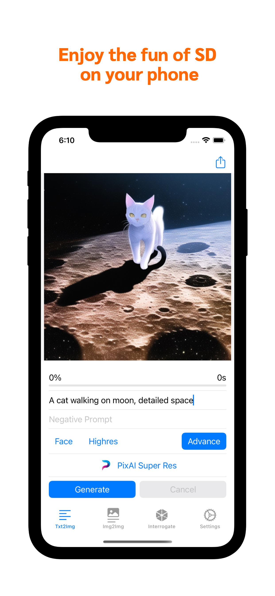
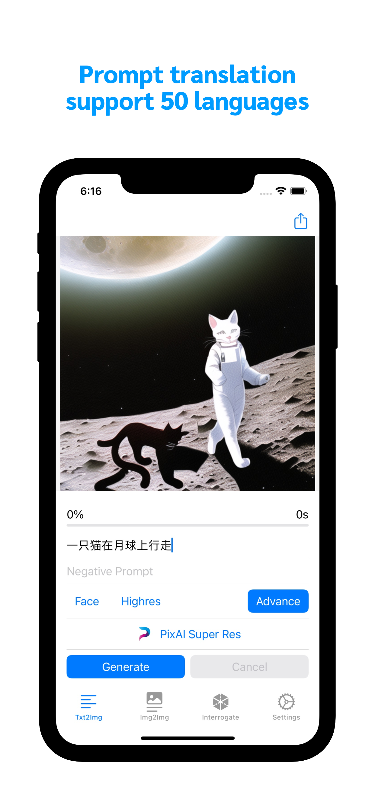
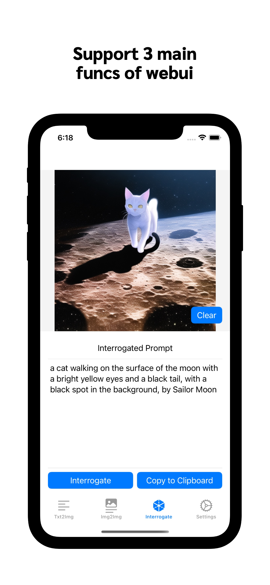
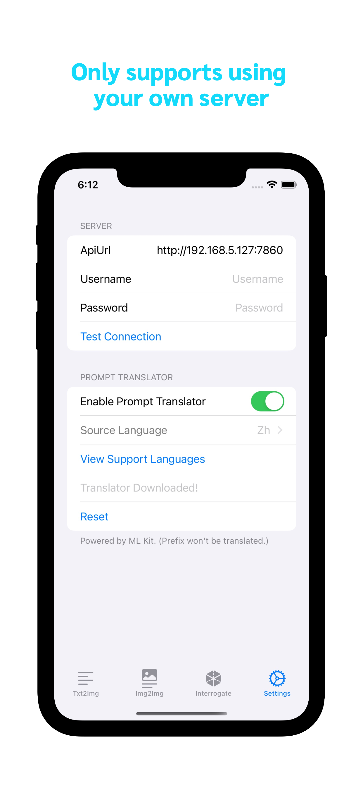

# HandyDiffu
### An iOS client for stable diffusion
HandyDiffu is a third party client for [AUTOMATIC1111/stable-diffusion-webui](https://github.com/AUTOMATIC1111/stable-diffusion-webui) 
## Download
<a href="https://apps.apple.com/us/app/handydiffu/id6444753824"></a>   
**[Download from AppStore](https://apps.apple.com/us/app/handydiffu/id6444753824)**  
## ScreenShot   


## Additional Features：
1. Prompt automatic translation ( more than 50 languages supported, powered by MLKit )
2. Send pictures directly to PixAI for super-resolution （ An app that uses CoreML for on device super-resolution, also developed by me. It support ```realesrgan realcugan gfpgan``` etc. Will 
be avaliable on AppStore soon. )


## Server Deployment
### **You must having your own server to use this client!**
- For server deployment, please refer to [Wiki](https://github.com/AUTOMATIC1111/stable-diffusion-webui/wiki/Command-Line-Arguments-and-Settings) and [Enable API](https://github.com/AUTOMATIC1111/stable-diffusion-webui/wiki/API) 
- You need to lanuch server with args ```"--api --listen"```.   
- For remote connection to your local PC, I personllay recommend using tailscale or frp, in case no having a public IP.

## Usage
1. Set your server api on ```settings tab```, and make sure ```test connection``` return ```success```
2. Enable ```prompt translator ``` on ```settings tab```, and make sure ```translator download``` return ```success```
3. You can now enjoy your journey.



